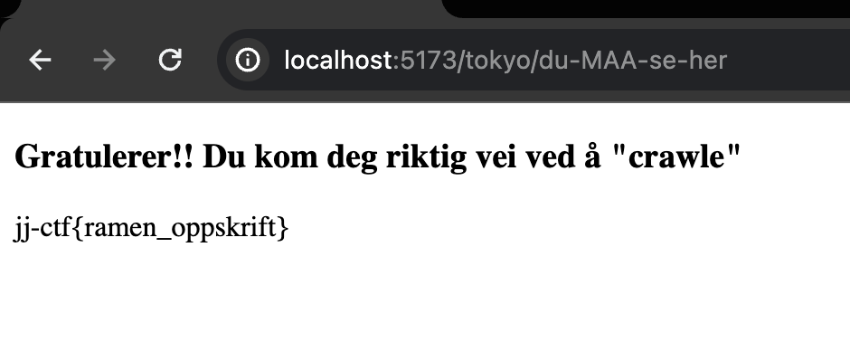

# Hvordan finne alle flaggene i Japan Julian-CTF

Dette er en veiledning for de som prøver seg på JJ-CTF'en. Flaggene ligger noen ganger litt godt gjemt og det er noen feller å gå i.
Men hvis du følger denne til punkt og prikke så skal det gå lett som en plett, og du kan finne alle sammen.
Pluss et bonus flagg hvis du ikke vet om det fra før av 

## Flagget til Kyoto

Når du kommer til hjemmesiden så naviger deg til Kyoto siden, ved å trykke på den blå Kyoto linken.
Du ser ingenting med en gang du kommer inn, men hvis du markerer hele siden, så kommer det opp en hemmelig bedskjed.

Du kan også finne beskjeden ved å gå til inspekt og lete deg fram i koden til beskjede.
Her står det at du skal sjekke console.log, og når du gjør det så kommer det noe interessant opp.

Her ser vi at det er en string som er kryptert, som vi kan enda sikkrere vite på grunn av settningen ovenfor som hinter til at den er kryptert med B64.
Vi kopierer koden inn i en B64 krypterer. Jeg bruker dcode sin, men du kan bruke hvilke som helst.
Og da får vi dette flagget:

Da er det bare å legge den inn i Kyoto eiendel på hjemmesiden og da er det første flagget ferdig :)

## Flagget til Tokyo

Dette flagget er litt mer vrient å håndtere seg med, men når du først vet om trikset, er det fikset på null komma niks.
Prøver du å markere siden skjer det ikke mye, heller ikke om du inspecter det. Men du får allerede et hint av det som står der

Her står det at vi har gått feil, og at det er kun roboter som kan komme seg fram. Fordi det har seg nemmlig sånn at viss du skriver inn robots.txt som under mappe på hjemmesiden, så kommer det opp alle "skjulte" mapper og sider som hjelper roboter med å navigere.
Men vi kan allikevel gjøre det samme.

Her ser vi flere undermapper og sider, men vi trenger bare å bry oss om én. Det er flagget til Tokyo som vi leter etter, så da kan vi skrive inn /tokyo/du-MAA-se-her inn i URL'en på hjemmesiden.

Og da fant vi flagget, uten å bli lurt til å gå til en annen side. Pheww, da slapp vi unna det.
Nå kan vi lime inn flagget i Tokyo eiendel på hjemmesiden, og da har du det andre flagget i boks.
Over på det siste, og mest vanskelige flagget

## Flagget til Hiroshima

Når vi klikker oss inn på Hiroshima siden, så er det ikke mye som kommer. Bare et kjempe stort bildet.
Men her kommer det lure med det, og hvis du har følgt med i datasikkerhet timene, så skjønner du at noe gjemmer seg her.

Vi kan nemlig laste ned bildet ved å høyre klikke på det og trykke "save image as".

Vi kan så ta bildet i et decode program for å dekryptere det, jeg bruker nå Steganography av stylesuxx på Github for å dekryptere det men du kan bruke noe annet om du vil gjøre det også :)
Etter jeg har satt inn bildet og trykket på decode, så kan vi se at flagget har faktisk gjemt seg i bildet, og nå fant vi det endelig!

Da er det bare å lime flagget inn i Hiroshima eiendel på hjemmesiden en siste gang. Og når du har gjort det, så kommer det en gratulerer side opp, og du kan si deg ferdig for dagen :)
Godt jobbet!!

Og om du skulle støte på noen problemer med å få gratulerer siden opp, så prøv å lime in flaggene en etter en inn på nytt, og trykke på submit uten å gå vekk fra hjemsiden hver gang

